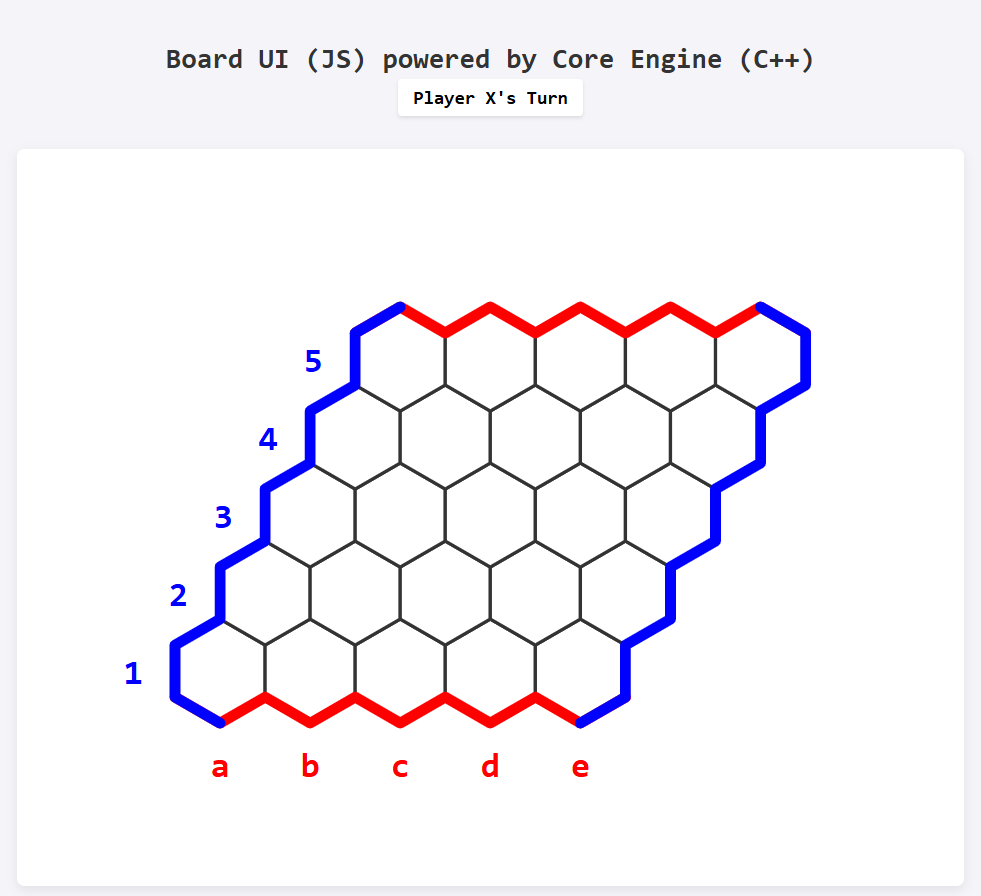
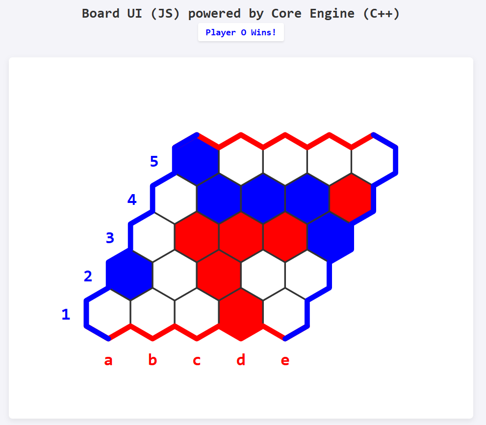

# Hex Board Game

A browser-based implementation of the classic **Hex** strategy board game, featuring a high-performance C++ game engine compiled to WebAssembly and a clean SVG-rendered JavaScript frontend. Play against an AI opponent powered by a Monte Carlo simulation algorithm — all running locally in your browser, with zero server dependencies.

---

<table>
  <tr>
    <td></td>
    <td></td>
  </tr>
</table>

## Table of Contents

- [About the Game](#about-the-game)
- [How to Play](#how-to-play)
- [Win Condition](#win-condition)
- [Project Architecture](#project-architecture)
- [File Structure](#file-structure)
- [Core Engine (C++)](#core-engine-c)
  - [Graph Class](#graph-class)
  - [Stack Class](#stack-class)
  - [Simulation Class](#simulation-class)
  - [MonteCarlo Class](#montecarlo-class)
- [Frontend (JavaScript + SVG)](#frontend-javascript--svg)
- [AI: Monte Carlo Method](#ai-monte-carlo-method)
- [Building from Source](#building-from-source)
- [Running the Game](#running-the-game)
- [Configuration & Customization](#configuration--customization)
- [Known Limitations & Future Work](#known-limitations--future-work)

---

## About the Game

Hex is a two-player abstract strategy game invented independently by mathematician Piet Hein (1942) and John Nash (1948). It is played on a rhombus-shaped board of hexagonal cells. Despite its simple rules, Hex is a deeply strategic game — it has been proven that the first player always has a winning strategy, yet computing that strategy for large boards remains an unsolved problem.

This implementation uses a **5×5 board** (configurable) and pits a human player (**Red / X**) against an AI opponent (**Blue / O**).

---

## How to Play

1. Open `index.html` in a modern browser (requires WebAssembly support).
2. **Red (X)** always goes first. Click any empty hexagonal cell to place your piece.
3. The AI (**Blue / O**) will respond automatically after a brief pause.
4. Players alternate turns until one player completes an unbroken chain connecting their two sides of the board.
5. The status bar at the top tracks whose turn it is and announces the winner.

> **Note:** Once a piece is placed, it cannot be moved or removed. There are no draws in Hex — the game always produces a winner.

---

## Win Condition

Each player owns two opposite sides of the board:

| Player | Color | Goal |
|--------|-------|------|
| **X** (Human) | 🔴 Red | Connect the **top edge** to the **bottom edge** |
| **O** (AI) | 🔵 Blue | Connect the **left edge** to the **right edge** |

A win is detected by a **Depth-First Search (DFS)** through the player's occupied cells. The DFS starts from every cell on the player's starting edge and checks whether a path reaches the opposite edge through connected, same-colored hexagons.

Each hexagonal cell has exactly **6 neighbours**, defined by the offset vectors:

```
dx[] = {-1,  1,  0,  1, -1,  0}
dy[] = {  0,  0, -1, -1,  1,  1}
```

---

## Project Architecture

The project follows a clean **two-layer architecture**:

```
┌─────────────────────────────────────────┐
│           Browser (index.html)          │
│                                         │
│   ┌─────────────────────────────────┐   │
│   │   UI Layer  (index.js + SVG)    │   │
│   │  - Renders the hex board        │   │
│   │  - Handles click events         │   │
│   │  - Manages turn flow & display  │   │
│   └──────────────┬──────────────────┘   │
│                  │  Emscripten Bindings  │
│   ┌──────────────▼──────────────────┐   │
│   │   Core Engine  (engine.cpp)     │   │
│   │   compiled → engine.js (WASM)   │   │
│   │  - Graph / board state          │   │
│   │  - Move validation              │   │
│   │  - DFS win detection            │   │
│   │  - Monte Carlo AI               │   │
│   └─────────────────────────────────┘   │
└─────────────────────────────────────────┘
```

The C++ engine is compiled to **WebAssembly** via [Emscripten](https://emscripten.org/), producing `engine.js` which bootstraps the WASM module and exposes the `Graph` class to JavaScript through Emscripten's `EMSCRIPTEN_BINDINGS` macro.

---

## File Structure

```
hex-game/
├── index.html       # Entry point — loads the board UI and WASM module
├── index.js         # Frontend logic: rendering, event handling, turn management
├── engine.cpp       # C++ game engine: board state, DFS, Monte Carlo AI
├── engine.js        # Generated by Emscripten (WASM glue code) — not in repo
├── styles.css       # Board and cell styling
└── README.md        # This file
```

---

## Core Engine (C++)

The engine (`engine.cpp`) is written in standard C++17 and compiled to WebAssembly using Emscripten. It owns all game logic — the JavaScript layer only handles rendering and user input.

### Graph Class

The central data structure. Represents the board as a 2D grid of `Cell` structs.

```cpp
typedef struct Cell {
    int x, y;
    bool isOccupied;
    char Player;   // 'X', 'O', or '\0'
} Cell;
```

**Public API (exposed to JavaScript via Emscripten):**

| Method | Signature | Description |
|--------|-----------|-------------|
| Constructor | `Graph(int w, int h)` | Creates an empty `w × h` board |
| `Move` | `bool Move(string player, int x, int y)` | Places a piece at `(x, y)`. Returns `false` if the cell is already occupied or out of bounds. |
| `CheckForWin` | `bool CheckForWin(string player)` | Runs a DFS to check whether `player` has formed a winning chain. |
| `GetCellState` | `string GetCellState(int x, int y)` | Returns `"X"`, `"O"`, or `"."` for the given cell. |
| `GetBestMoveAI` | `val GetBestMoveAI(string player, int simulations)` | Returns a JavaScript array `[x, y]` representing the AI's best move after running Monte Carlo simulations. |

**Private helpers:**

- `Instantiate(w, h)` — initialises the grid with empty, unoccupied cells.
- `CheckForOccupied(i, j)` — bounds-checked occupancy test.
- `DFS(x, y, player, visited, isTopToBottom)` — recursive depth-first search for win detection. The `isTopToBottom` flag selects the win axis: vertical for X, horizontal for O.

---

### Stack Class

A custom LIFO stack backed by a `vector<pair<int,int>>` used internally by the `MonteCarlo` class to enumerate candidate moves.

| Method | Description |
|--------|-------------|
| `Insert(pair<int,int>)` | Pushes a coordinate pair onto the stack |
| `Top()` | Returns the top element without removing it (throws on empty) |
| `Pop()` | Removes and returns the top element; returns `(-1, -1)` on empty |
| `Empty()` | Returns `true` if the stack contains no elements |

> **Design note:** Using a custom stack here rather than `std::stack` keeps the dependency surface explicit and makes the candidate-move iteration order straightforward to reason about.

---

### Simulation Class

Inherits from `Graph`. Represents a single **random playout** from the current board state.

On construction, it collects all empty cells into `AvailableMoves`. When `Run()` is called, it shuffles those moves using a Mersenne Twister (`mt19937`) seeded from a hardware random device, then alternately fills every remaining cell for both players — simulating a complete, random game to its conclusion.

```cpp
void Run() {
    shuffle(AvailableMoves.begin(), AvailableMoves.end(), gen);
    for (const auto& move : AvailableMoves) {
        Move(string(1, Player), move.first, move.second);
        Player = (Player == 'X') ? 'O' : 'X';
    }
}
```

This produces a random terminal game state that can then be evaluated for a win using `CheckForWin`.

---

### MonteCarlo Class

Wraps the simulation loop and implements the core AI decision algorithm.

**`GetBestMove(int simulations)`**:

For every empty cell on the board (treated as a candidate first move for the AI):
1. Clone the current `Graph` state.
2. Tentatively play the AI's piece at the candidate cell.
3. Run `simulations` random `Simulation::Run()` playouts from that state (alternating players, starting from the opponent's turn).
4. Count how many of those playouts resulted in a win for the AI.
5. Track whichever candidate cell accumulated the highest win count.

Returns the `(x, y)` coordinates of the best candidate, or `(-1, -1)` if no moves are available.

The default simulation count is **100 per candidate cell**, giving a reasonable balance of decision quality and response time on a 5×5 board.

---

## Frontend (JavaScript + SVG)

`index.js` handles all UI concerns. The board is rendered as an inline **SVG** for crisp, scalable display at any viewport size.

**Key responsibilities:**

- `Module.onRuntimeInitialized` — waits for the Emscripten WASM module to finish loading before creating the `Graph` instance and rendering the initial board.
- `renderBoard()` — clears and fully redraws the SVG on every state change. Hexagons are rendered as `<polygon>` elements using flat-top orientation. Colour border strips (red top/bottom for X, blue left/right for O) are drawn as `<polyline>` elements to visually communicate each player's goal edges. Row and column labels are rendered as `<text>` elements.
- `handleCellClick(x, y)` — validates the move via `gameBoard.Move(...)`, checks for a win, then either switches turns (two-player mode) or triggers the AI after a 100 ms `setTimeout` (to allow the browser to repaint first).
- `processGameEndState()` — checks for a win after every move. Disables board interaction and updates the status display on game end.
- `updateStatusDisplay()` — keeps the status bar in sync with the current player, using red/blue colour coding.

**Hexagon geometry:**

Hexagons use a **pointy-top** layout with circumradius `R = 24px`. Cell centres are computed as:

```
cx = paddingX + W/2 + x * W + y * (W / 2)   // stagger columns by row
cy = svgHeight - (paddingY + R + y * 1.5 * R) // rows grow upward
```

where `W = √3 × R` is the flat-to-flat width of each hex.

---

## AI: Monte Carlo Method

The AI uses a **flat Monte Carlo Tree Search** (no UCB/tree policy — pure random rollouts). This is sometimes called "Monte Carlo simulation" rather than full MCTS.

**Algorithm summary:**

```
for each empty cell c on the board:
    wins = 0
    for i in 1..N:
        clone the board
        play AI's piece at c
        randomly fill all remaining cells (alternating players)
        if AI wins the resulting game: wins++
    score[c] = wins

return argmax(score)
```

**Strengths of this approach:**
- Simple to implement and reason about.
- No handcrafted heuristics — the AI "learns" from statistics alone.
- Naturally handles the game's lack of draws.
- Embarrassingly parallelisable (not implemented here, but possible).

**Limitations:**
- Flat MC without a tree policy can miss deep tactical lines.
- Performance scales as `O(empty_cells × simulations × board_size)` — manageable on 5×5, but would need MCTS (UCT) for boards of 11×11 or larger.
- The quality of the AI is directly proportional to `simulations`; 100 is the current default.

---

## Building from Source

### Prerequisites

- [Emscripten SDK](https://emscripten.org/docs/getting_started/downloads.html) (tested with `emsdk 3.x`)
- A Unix-like shell (Linux, macOS, or WSL on Windows)

### Compile the engine

```bash
emcc engine.cpp \
  -o engine.js \
  -lembind \
  -s MODULARIZE=0 \
  -s EXPORT_NAME="Module" \
  -s ALLOW_MEMORY_GROWTH=1 \
  -s EXPORTED_RUNTIME_METHODS='["ccall","cwrap"]' \
  -O2
```

This produces `engine.js` (Emscripten glue) and `engine.wasm` (compiled binary). Both files must be served alongside `index.html` and `index.js`.

> **Tip:** Increase `-O2` to `-O3` for a meaningful speedup in simulation throughput, at the cost of longer compile times.

---

## Running the Game

Because the page loads a WebAssembly module, it **must be served over HTTP** — opening `index.html` directly as a `file://` URL will fail due to browser CORS restrictions on WASM loading.

**Quickstart with Python:**

```bash
# Python 3
python3 -m http.server 8080

# Then open:
# http://localhost:8080/index.html
```

**Or with Node.js / `npx serve`:**

```bash
npx serve .
```

---

## Configuration & Customization

All board parameters live at the top of `index.js`:

```js
const width  = 5;   // Board columns
const height = 5;   // Board rows
let isAIEnabled = true;  // false = two-player local mode
```

The simulation count for the AI is set in `handleCellClick`:

```js
const aiMove = gameBoard.GetBestMoveAI(currentPlayer, 100);
//                                                     ^^^
//                                        Increase for stronger AI
```

**Scaling guidance:**

| Board Size | Recommended Simulations | Approx. Response Time |
|------------|------------------------|-----------------------|
| 5×5 | 100 | ~50–150 ms |
| 7×7 | 50–80 | ~200–500 ms |
| 11×11 | 20–30 | ~1–3 s (may feel slow) |

For boards larger than 7×7, consider switching to a proper MCTS implementation with UCB1 selection.

---

## Known Limitations & Future Work

- **No undo / reset button** — refreshing the page starts a new game.
- **No two-player network mode** — multiplayer is local only (toggle `isAIEnabled = false`).
- **Flat MC AI** — a full UCT-based MCTS would significantly improve AI strength on larger boards.
- **No swap rule** — the standard Hex swap rule (allowing the second player to "steal" the first move) is not implemented, which means the first player retains a theoretical advantage.
- **Fixed board size at load time** — the board size is hardcoded in `index.js`; a UI control to select board size could be added.
- **No mobile touch optimisation** — the SVG click targets work on touch but are not optimised for small screens.

---

## License

For licensing, check the LICENSE file.
